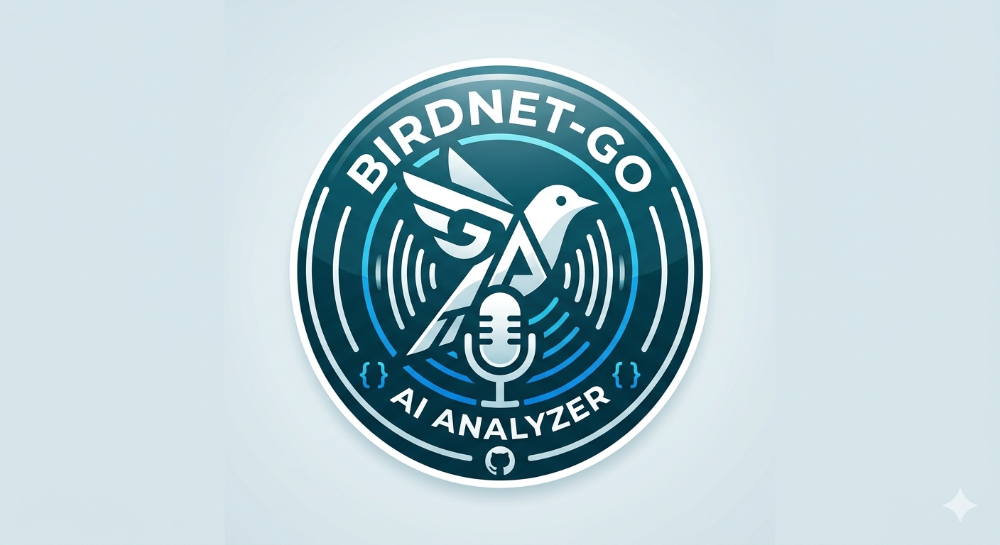

# BirdNET-Go (bcardi0427 Fork)

This repository is a comprehensive reprogramming of BirdNET-Go, featuring the **AI Analyzer** and other custom enhancements. Originally based on `tphakala/birdnet-go`.

<p align="center">
  
</p>

## AI Analyzer

The AI Analyzer is a major component of this fork. 


Quick install for the AI Analyzer:

```bash
curl -fsSL https://raw.githubusercontent.com/bcardi0427/birdnet-go-aianalyzer/aianalyzer/main/install-aianalyzer.sh -o install-aianalyzer.sh
bash ./install-aianalyzer.sh
```

Fork-specific documentation:

- [AI Analyzer docs](docs/aianalyzer/README.md)
- [Wrapper installer script](install-aianalyzer.sh)
- [Proxmox helper LXC upgrade script](scripts/install-aianalyzer-lxc.sh)

This fork remains under the upstream BirdNET-Go license and privacy expectations. Review scripts before running them, especially when installing directly from GitHub.

<p align="center">
  <!-- Project Status -->
  <a href="https://github.com/bcardi0427/birdnet-go-aianalyzer/releases">
    
  </a>
  <a href="https://creativecommons.org/licenses/by-nc-sa/4.0/">
    
  </a>
  

  <br>

  <!-- Code Quality -->
  <a href="https://golang.org">
    
  </a>
  <a href="https://goreportcard.com/report/github.com/bcardi0427/birdnet-go-aianalyzer">
    
  </a>

  <br>

  <!-- Community -->
  <a href="https://github.com/bcardi0427/birdnet-go-aianalyzer/network/members">
    
  </a>
  <a href="https://github.com/bcardi0427/birdnet-go-aianalyzer/graphs/contributors">
    
  </a>
  <a href="https://github.com/bcardi0427/birdnet-go-aianalyzer/issues">
    
  </a>
</p>

BirdNET-Go is an AI solution for continuous avian monitoring and identification

- 24/7 realtime bird and bat sound analysis of soundcard capture, analysis output to log file, SQLite or MySQL
- Built-in model gallery with multiple AI classifiers:
  - **BirdNET v2.4** (6,500+ bird species, included by default)
  - **Google Perch v2** (14,795 bird species)
  - **BattyBirdNET** (11 regional bat classifiers covering Africa, Americas, East Asia, Europe, Middle East, South Asia, Southeast Asia, and USA)
- **BirdNET Geomodel v3.0** for location-based species range filtering
- Run multiple models simultaneously on separate audio sources
- Local processing, Internet connectivity not required
- Easy to use Web user interface for data visualisation
- Supports over 40 languages for species names
- Advanced features like [Deep Detection](docs/wiki/guide.md#deep-detection) for improved accuracy and [Live Audio Streaming](docs/wiki/guide.md#live-audio-streaming).
- BirdWeather.com API integration
- Realtime log file output can be used as overlay in OBS for bird feeder streams etc.
- Minimal runtime dependencies, BirdNET Tensorflow Lite model is embedded in compiled binary
- Provides endpoint for Prometheus data scraping
- Runs on Windows, Linux and macOS
- Low resource usage, works on Raspberry Pi 4 and equivalent 64-bit single board computers

## Installation

Quick install script for Debian, Ubuntu and Raspberry Pi OS based systems:

```bash
curl -fsSL https://raw.githubusercontent.com/bcardi0427/birdnet-go-aianalyzer/aianalyzer/main/install.sh -o install.sh
bash ./install.sh
```

## Development Setup

For developers who want to contribute or build from source:

> See [CONTRIBUTING.md](CONTRIBUTING.md#step-1-install-task-runner) for more details.

```bash
# Clone the repository
git clone https://github.com/bcardi0427/birdnet-go-aianalyzer.git
cd birdnet-go-aianalyzer

# Install Task (if not already installed)
# Linux: sh -c "$(curl --location https://taskfile.dev/install.sh)" -- -d -b /usr/local/bin
# macOS: brew install go-task (assumes Homebrew is installed)

# Setup development environment (Linux apt-based or macOS with homebrew)
task setup-dev

# Build the project
task

# Start development server with hot reload
task dev_server # or "air realtime"
```

The `setup-dev` task will automatically install:

- Go 1.25
- Node.js LTS
- Build tools (gcc, git, wget, etc.)
- golangci-lint (Go linter)
- air (hot reload for Go)
- Frontend dependencies and Playwright browsers

## Web Dashboard


### Local Hostname Access

To access the dashboard via a clean local hostname rather than `localhost:8080`, you can resolve the application at **`http://birdnet-go.local:8080`**:
- **Windows**: Run the **`setup_hosts.ps1`** script as Administrator (it will request elevation to add `birdnet-go.local` to your local hosts file).
- **Linux/macOS**: Running the `install-aianalyzer.sh` wrapper script with `sudo` will configure this automatically. Alternatively, manually add `127.0.0.1 birdnet-go.local` to your `/etc/hosts` file.

For detailed installation instructions, see the [installation documentation](docs/wiki/installation.md). For securing your BirdNET-Go installation, see the [security documentation](docs/wiki/security.md). See [recommended hardware](docs/wiki/hardware.md) for optimal performance.

There is more detailed usage documentation at [Wiki](docs/wiki/guide.md)

## Community

Contributions, issues, and feature requests are welcome! Feel free to check the [issues page](https://github.com/bcardi0427/birdnet-go-aianalyzer/issues).

## Related Projects

### Core & Extensions

- [BirdNET-Analyzer](https://github.com/birdnet-team/BirdNET-Analyzer) - Upstream project providing the BirdNET AI model for bird sound identification
- [BirdNET-Go Classifiers](https://github.com/tphakala/birdnet-go-classifiers) - Enhanced BirdNET classifiers including additional species
- [BattyBirdNET-Analyzer](https://github.com/rdz-oss/BattyBirdNET-Analyzer) - Bat classifier models for regional bat detection, installable via the model gallery

### System Integration

- [Cockpit BirdNET-Go](https://github.com/tphakala/cockpit-birdnet-go) - Web-based system management plugin for BirdNET-Go using Cockpit framework

### Migration Tools

- [BirdNET-Pi2Go](https://github.com/tphakala/birdnet-pi2go) - Database conversion tool for migrating from BirdNET-Pi to BirdNET-Go

### Hardware Solutions

- [BirdNET-Go ESP32 RTSP Microphone](https://github.com/Sukecz/birdnetgo-esp32-rtsp-mic) - ESP32-based RTSP streaming microphone for remote audio capture
- [ESP32 Audio Streamer](https://github.com/jpmurray/esp32-audio-streamer) - Alternative ESP32 RTSP streaming solution for BirdNET-Go audio input
- [M5Stack Atom Echo RTSP Mic](https://github.com/stedrow/birdnetgo-m5stack-atom-echo-rtsp-mic) - RTSP audio streaming server for M5Stack Atom Echo, no soldering required
- [M5Stack AtomS3 Lite PDM Mic](https://github.com/matthew73210/birdnetgo-m5stack-AtomS3-Lite-PDM-rtsp-mic) - RTSP audio streaming server for M5Stack AtomS3 Lite with MEMS PDM microphone

### Mobile Apps

- [Perch](https://github.com/arunrajiah/perch) - Open-source Android/iOS companion app. Connects to your BirdNET-Go station via the BirdWeather API. Live detection feed, audio playback, species browser, 14-day chart, and local notifications for favourite species. MIT licensed.

## Data Sources

### Taxonomy Data

BirdNET-Go includes embedded taxonomy data derived from the eBird/Clements Checklist:

- **Source**: [eBird API v2](https://api.ebird.org/v2/ref/taxonomy/ebird)
- **Copyright**: © Cornell Lab of Ornithology
- **License**: Used under eBird API Terms of Use for non-commercial purposes
- **Attribution**: Taxonomy data powered by [eBird.org](https://ebird.org)
- **Purpose**: Provides fast local genus/family lookups without requiring API calls
- **Coverage**: 2,374 genera, 254 families, 11,145 species

For more information about eBird's taxonomy, visit [eBird Taxonomy](https://ebird.org/science/use-ebird-data/the-ebird-taxonomy).

## License

Creative Commons Attribution-NonCommercial-ShareAlike 4.0 International

## Authors

Jerry Haygood (Bcardi0427)

Original BirdNET-Go codebase by Tomi P. Hakala.

BirdNET AI model by the K. Lisa Yang Center for Conservation Bioacoustics at the Cornell Lab of Ornithology in collaboration with Chemnitz University of Technology. Stefan Kahl, Connor Wood, Maximilian Eibl, Holger Klinck.

Google Perch v2 ONNX conversion by [Justin Chuby](https://huggingface.co/justinchuby/BirdNET-onnx). BattyBirdNET bat classifier models by [R.D. Zinck](https://github.com/rdz-oss/BattyBirdNET-Analyzer).

BirdNET label translations by Patrick Levin for BirdNET-Pi project by Patrick McGuire.
