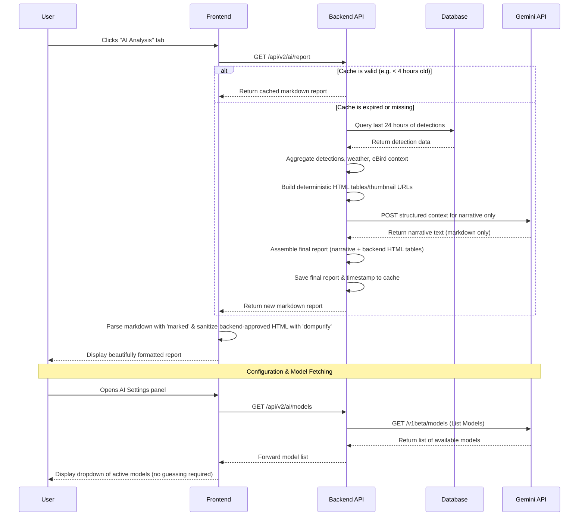

# BirdNET-Go AI Analysis Blueprint

This document outlines the architecture and implementation steps for adding Gemini AI-powered daily reports to BirdNET-Go. Save this file as a reference for when you are ready to begin the implementation.

## Architecture Visualization



## Implementation Checklist

### 1. Configuration (`internal/conf/config.go`)
- [ ] Add an `AI` struct to the main `Settings` struct.
- [ ] Add fields: `Enabled`, `APIKey`, `Model`, `CacheHours`, `SystemPrompt`.

### 2. Backend Routes (`internal/api/v2/ai.go` & `router.go`)
- [ ] Create `GetAIReport` handler to fetch data, call Gemini, and manage the cache.
- [ ] Create `GetAIModels` handler to dynamically fetch available models from Gemini.
- [ ] Register `GET /api/v2/ai/report` and `GET /api/v2/ai/models` in the router.

### 2a. Prompt Inputs: Weather + eBird Enrichment
- [ ] **Weather:** Pull last-24h weather context from the existing OpenWeather integration and include a summarized block in the prompt (e.g., temp min/max, precipitation, wind avg/max, notable conditions).
- [ ] **eBird:** Use the existing eBird API integration to enrich the report with local context (e.g., whether detected species are expected/recent in the region, and provide links to species pages).

### 2b. Report Assembly Boundary (Backend Facts/Tables, Gemini Narrative Only)
- [ ] **Backend owns facts, tables, links, and images. Gemini owns narrative interpretation only.**
- [ ] Backend should generate deterministic HTML tables for structured sections (e.g., “Daily Totals”, “Top Detections”, “Notable/Unusual”, “Confidence Breakdown”, “Weather Summary”).
- [ ] Gemini should return **markdown narrative only** (overview, activity interpretation, weather correlation commentary, notable observations summary).
- [ ] Do **not** ask Gemini to generate `<table>`, ``, or arbitrary HTML. This reduces hallucination, invalid markup, image provenance risk, and sanitization complexity.
- [ ] Backend should include **inline thumbnails** in its own HTML tables when available (e.g., ``), with a fallback to links-only if no image is available.

#### Copyright / provenance policy (important)
- [ ] **Do not allow Gemini to provide or suggest third-party image URLs.** All thumbnails must be rendered using BirdNET-Go controlled endpoints (e.g., `/api/v2/media/species-image?...`) so image provenance/attribution is handled by the app.
- [ ] If AI-generated images are ever added (e.g., user-provided “Nano Banana” style assets), store them as first-party assets with explicit user intent and clear labeling ("AI-generated").
- [ ] Backend should reject or strip any Gemini-generated image tags/URLs if they appear despite prompt instructions.

### 3. Frontend Dependencies (`frontend/package.json`)
- [ ] Run `npm install marked dompurify` and `npm install -D @types/marked @types/dompurify`.

### 4. Frontend UI (`frontend/src/`)
- [ ] Create `AIAnalysisPage.svelte` to fetch and render the markdown report.
- [ ] Create an `AIConfig.svelte` panel for the settings page (API Key, Model dropdown, Cache Hours).
- [ ] Add the "AI Analysis" page to the sidebar navigation and `App.svelte` routing.

### 4a. Frontend Rendering + Sanitization (HTML allowed)
- [ ] Configure `DOMPurify` to allow a **safe allowlist** of tags/attributes needed for backend-generated tables and links:
  - Tags: `table`, `thead`, `tbody`, `tr`, `th`, `td`, `caption`, `a`
  - Attributes: `href`, `title`, `rel`, `target`
- [ ] Allow `img` with safe attributes for backend-generated inline thumbnails: `src`, `alt`, `title`, `loading`, `width`, `height`.

### 4b. Image Handling Policy (Inline Thumbnails)
- [ ] Use **BirdNET-Go local media endpoints only** for thumbnails. Do not use AI-provided or arbitrary remote image URLs.
- [ ] Ensure backend-generated `img` tags always include `loading="lazy"`, useful `alt` text, and fixed `width`/`height` to prevent layout shift.

### 4c. Reuse Existing Local Thumbnail Cache / Proxy (Recommended for v1)
- [ ] Do **not** add a second AI-specific thumbnail cache for v1 unless the existing image system proves insufficient.
- [ ] **Leverage existing built-in image proxy/cache:** BirdNET-Go already exposes cached species image endpoints:
  - `GET /api/v2/media/species-image?name={SCIENTIFIC_NAME}` (also accepts `scientific_name` in some call sites)
  - Attribution/info: `GET /api/v2/media/species-image/info?name={SCIENTIFIC_NAME}`
  - Cached file proxy route: `GET /api/v2/media/image/{SCIENTIFIC_NAME}`
  - When generating report HTML, use these local endpoints for `` to avoid external hotlinking and centralize attribution/provenance.
- [ ] **Source of images:** If the internal species-image provider cannot return an image for a given species, fall back to links-only (or optionally add an alternate provider later).

### 4d. Guardrails: Prevent AI-supplied Image Sources
- [ ] In the system prompt: explicitly instruct the model to **never** output external image URLs.
- [ ] In the backend: post-process Gemini narrative and strip/deny any `` tags or image URLs if they appear despite instructions (defense in depth).

---

## Example: Fetching Available Models

To implement the `GetAIModels` handler and populate the model dropdown in the UI, we will use the `google.golang.org/genai` package. Here is a reference snippet demonstrating how to list the available models:

```go
package main

import (
	"context"
	"fmt"
	"log"

	"google.golang.org/genai"
	"google.golang.org/api/iterator" // Standard for Google SDK pagination
)

func main() {
	ctx := context.Background()

	// Initialize the client. It automatically picks up your GEMINI_API_KEY environment variable.
	client, err := genai.NewClient(ctx, nil)
	if err != nil {
		log.Fatalf("Failed to create client: %v", err)
	}

	// Fetch the model iterator
	modelIterator := client.Models.List(ctx, nil)

	// Loop through and print the results
	for {
		model, err := modelIterator.Next()
		if err == iterator.Done {
			break
		}
		if err != nil {
			log.Fatalf("Failed to fetch model: %v", err)
		}

		fmt.Printf("Model ID: %s\n", model.Name)
		fmt.Printf("Display Name: %s\n", model.DisplayName)
		fmt.Println("--------------------------------------------------")
	}
}
```

---

## Example: Generating a Report

When implementing the `GetAIReport` handler, we will use the `GenerateContent` method to send our constructed prompt (containing the detection data) to the selected Gemini model. Here is a reference snippet for text generation:

```go
package main

import (
	"context"
	"fmt"
	"log"

	"google.golang.org/genai"
)

func main() {
	ctx := context.Background()

	// Initialize the client
	client, err := genai.NewClient(ctx, nil)
	if err != nil {
		log.Fatalf("Failed to create client: %v", err)
	}

	// The prompt you will construct from the database detections
	prompt := "Write a brief summary of bird activity given the following data: [Data Here]"
	
	// Call GenerateContent
	// Provide your dynamically selected model from the configuration, e.g., "gemini-2.5-flash"
	result, err := client.Models.GenerateContent(ctx, "gemini-2.5-flash", genai.Text(prompt), nil)
	if err != nil {
		log.Fatalf("Error generating content: %v", err)
	}

	// Result.Text() is a helper that concatenates all text parts in the response
	fmt.Println(result.Text())
}
```

---

## Future Expansion Ideas

Once the base AI reporting is set up, here are some ideas for future updates that would pair perfectly with this feature:

1. **Weather Integration for Better Context**
   - **Idea:** Fetch local weather data (temperature, rain, wind) for the past 24 hours and inject it into the prompt.
   - **Why:** The AI could make correlations like, "Due to the heavy rain yesterday evening, owl detections were unusually low, but songbird activity spiked this morning as the weather cleared."

1a. **eBird Integration for Better Context**
   - **Idea:** Enrich detections with eBird “recent observations in region” context and species links.
   - **Why:** The report can highlight unusual detections (e.g., detected locally but not commonly reported recently) and provide quick jump-links for verification.

2. **Trend Analysis Over Time**
   - **Idea:** Instead of just looking at the last 24 hours, pass in data from the last 7 days and ask the AI to identify trends.
   - **Why:** The AI could notify you of migratory patterns, such as "Yellow-rumped Warblers have increased by 40% this week, indicating the start of their spring migration."

3. **Rare Bird / Anomaly Alerts**
   - **Idea:** Have a background worker run the AI analysis independently whenever a bird with a high confidence score but *very low historical frequency* in your database is detected.
   - **Why:** It could send a specialized push notification or email summarizing the rare event ("A Painted Bunting was just heard for the first time in 6 months!").

4. **Custom Report Personas**
   - **Idea:** Add a setting in the UI to change the "Tone" or "Persona" of the report.
   - **Why:** You could have the report read like a scientific ornithology paper, a casual birder's diary, or even a pirate for fun.

5. **Audio Description Summaries**
   - **Idea:** If Gemini 1.5/2.0 supports direct audio input (which it does via the Multimodal API), you could selectively send a few of the "Unidentified" audio clips to the AI for a second opinion.
   - **Why:** "I analyzed 3 unidentified clips from last night. While the primary model wasn't confident, the acoustic patterns closely resemble the distress call of a Northern Mockingbird."

---

## Suggested Report Sections (Example Outline)

This is an example structure the final report should aim to produce. Narrative should come from Gemini as markdown. Structured data, links, and thumbnails should be generated by the backend as deterministic, sanitized HTML tables.

> Implementation rule: **Backend owns facts, tables, links, and images. Gemini owns narrative interpretation only.**

1. **Bird Activity Summary**
   - Overview paragraph (key patterns, dawn chorus, evening activity)
   - Totals: detections, unique species, high-confidence %, clips saved

2. **Activity Trends**
   - Hourly pattern highlights (peak hour, quietest window)
   - Optional short “why” correlations using weather and known microphone/stream stats

3. **Most Frequently Detected Species**
   - HTML table with columns:
     - Thumbnail (from `/api/v2/media/species-image?name=...`)
     - Common name
     - Scientific name
     - Detections
     - Avg confidence
     - Peak time window
     - Links (eBird species page)

4. **Rare / Notable Detections**
   - Highlight low-frequency species (in local DB) or unusual time-of-day detections
   - Include confidence + timestamps + supporting context

5. **Environmental Correlation (Weather)**
   - Summarize wind/rain/temp and how it plausibly impacted detections

6. **Audio Quality / Recording Conditions**
   - Keep this conservative: only report what BirdNET-Go can actually measure
   - Avoid making up filter recommendations unless we can compute supporting metrics

7. **Confidence Breakdown**
   - Distribution buckets (95–100, 90–94, 80–89, <80)

8. **Long-term Trend Indicators (Optional)**
   - Compare last 24h to last 7/30 days (if we implement trend queries)

### IMPORTANT: Avoid Hallucinated Metrics
If a metric isn’t available in BirdNET-Go data sources, do not include it in the report.
Prefer “unknown/not available” over guessing.
