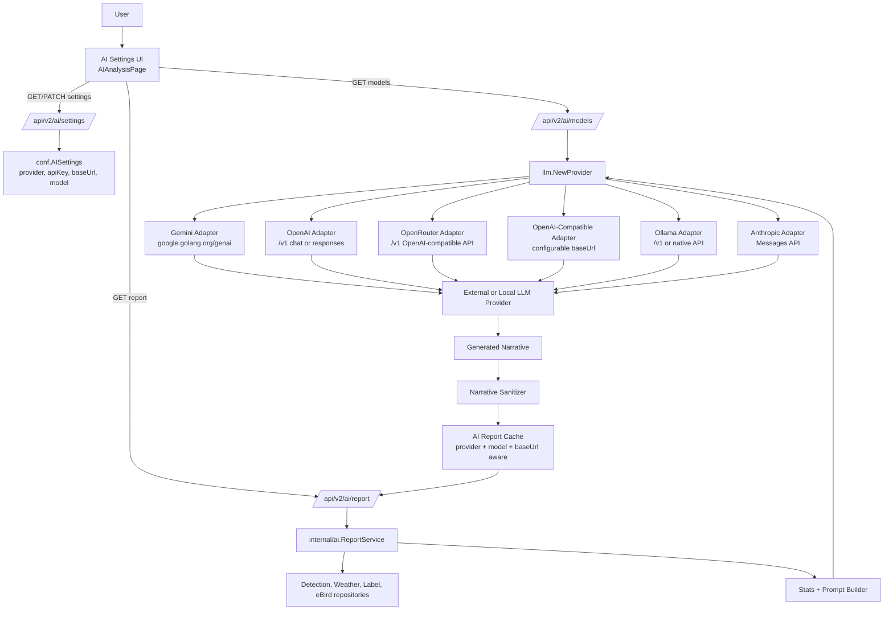

# LLM Provider Expansion Plan for AI Analyzer

## Goal

Add provider-neutral LLM support to the AI Analyzer daily report feature so BirdNET-Go can use more providers than the current Gemini-only implementation.

Initial provider targets:

- Google Gemini, preserving current behavior.
- OpenAI.
- OpenRouter.
- OpenAI-compatible providers such as LiteLLM, LM Studio, LocalAI, or self-hosted compatible APIs.
- Ollama.
- Anthropic.

## Deliverables

- Provider-neutral backend configuration for AI Analyzer settings.
- A common LLM provider interface used by the daily report service.
- Provider adapters for Gemini, OpenAI, OpenRouter, OpenAI-compatible APIs, Ollama, and Anthropic.
- Provider-aware model listing or graceful fallback behavior where model listing is unsupported.
- Provider-aware AI Settings UI updates.
- Backward-compatible migration/defaulting for existing Gemini users.
- Updated tests for config validation, API behavior, report generation, cache invalidation, and frontend settings behavior.
- Documentation with setup examples for each supported provider.

## Success Criteria

- Existing Gemini configurations continue to work without user action.
- `ai.provider` defaults to `gemini` when omitted.
- Users can select a provider in the AI Settings UI.
- API keys remain redacted in API responses and logs.
- Saving a redacted/masked key preserves the stored secret.
- OpenAI-compatible, OpenRouter, and Ollama providers support the correct provider base URLs.
- AI report cache invalidates when provider, base URL, model, system prompt, report window, cache duration, weather state, or eBird state changes.
- `internal/ai/service.go` no longer creates provider-specific clients directly.
- Tests pass for backend and frontend code touched by the implementation.

## Current State Summary

The current implementation is Gemini-specific in several places:

- `internal/ai/service.go`
  - Uses `google.golang.org/genai` directly.
  - Resolves only a Gemini API key via `resolveGeminiAPIKey()`.
  - Uses `defaultGeminiModel` and `geminiRequestTimeout` constants.
  - Logs Gemini narrative-generation failures.
  - Cache validation only includes model, prompt, report days, cache hours, AI enabled, weather enabled, and eBird enabled.
- `internal/conf/config.go`
  - `AISettings` has no provider or base URL field.
  - Existing fields are `Enabled`, `APIKey`, `APIKeyFile`, `Model`, `ReportDays`, `CacheHours`, and `SystemPrompt`.
- `internal/conf/validate_ai.go`
  - Validation messages mention Gemini directly.
  - API key and model are required whenever AI is enabled.
- `internal/api/v2/ai.go`
  - `/api/v2/ai/models` creates a Gemini client directly.
  - Logs use `gemini_api_key`.
  - Error responses mention Gemini API keys.
- `frontend/src/lib/utils/settingsApi.ts`
  - `AISettings` lacks provider and base URL fields.
- `frontend/src/lib/desktop/features/settings/pages/AISettingsPage.svelte`
  - Uses Gemini-specific labels, placeholders, and connection-test copy.
  - Default model is `gemini-2.5-flash`.

## Proposed Architecture

The target architecture separates UI/API concerns, report generation, and provider-specific LLM transport code. The daily report service should only build report facts/prompts and call a provider-neutral interface.



Key boundaries:

- `internal/api/v2/ai.go` handles HTTP, settings redaction, validation responses, and endpoint auth rules.
- `internal/ai/service.go` handles report facts, prompts, cache, fallback narrative, and sanitization.
- `internal/ai/llm/*` handles provider-specific request mapping, model listing, and response parsing.
- `internal/conf/*` handles provider-neutral settings, defaults, and validation.

## Proposed Configuration Shape

Use one active provider at a time with a unified credential field. This keeps the migration small and preserves the existing AI Settings flow.

```go
type AISettings struct {
    Enabled      bool   `yaml:"enabled" json:"enabled"`
    Provider     string `yaml:"provider" json:"provider"`
    APIKey       string `yaml:"apikey" json:"apiKey"`
    APIKeyFile   string `yaml:"apikeyfile" json:"apiKeyFile"`
    BaseURL      string `yaml:"baseurl" json:"baseUrl"`
    Model        string `yaml:"model" json:"model"`
    ReportDays   int    `yaml:"reportdays" json:"reportDays"`
    CacheHours   int    `yaml:"cachehours" json:"cacheHours"`
    SystemPrompt string `yaml:"systemprompt" json:"systemPrompt"`
}
```

### Provider IDs

Use stable lowercase provider IDs:

| Provider ID | Label | Notes |
|---|---|---|
| `gemini` | Google Gemini | Backward-compatible default. |
| `openai` | OpenAI | Uses OpenAI-hosted API. |
| `openrouter` | OpenRouter | Uses OpenRouter's OpenAI-compatible routing API and model catalog. |
| `openai-compatible` | OpenAI-compatible | Requires configurable `baseUrl`. |
| `ollama` | Ollama | Local-first provider. Should not require an API key by default. |
| `anthropic` | Anthropic | Uses Anthropic Messages API. |

### Provider Defaults

| Provider | Default model | Default base URL | API key required |
|---|---|---|---|
| `gemini` | `gemini-2.5-flash` | SDK default | Yes |
| `openai` | `gpt-4o-mini` or current preferred small model | `https://api.openai.com/v1` | Yes |
| `openrouter` | `openai/gpt-4o-mini` or user supplied | `https://openrouter.ai/api/v1` | Yes |
| `openai-compatible` | User supplied | Required | Usually yes |
| `ollama` | `llama3.2` or user supplied | `http://localhost:11434/v1` if using OpenAI-compatible mode | No by default |
| `anthropic` | `claude-3-5-haiku-latest` or current preferred small model | API default | Yes |

## Implementation Phases

### Phase 1: Add Provider-Neutral Settings

Files likely affected:

- `internal/conf/config.go`
- `internal/conf/defaults.go`
- `internal/conf/config_yaml_tags_test.go`
- `frontend/src/lib/utils/settingsApi.ts`

Tasks:

1. Add `Provider` and `BaseURL` fields to `conf.AISettings`.
2. Add default values:
   - `ai.provider`: `gemini`
   - `ai.baseurl`: empty for Gemini/OpenAI/Anthropic unless a provider-specific default is applied at runtime.
   - `ai.reportdays`: existing default `1`.
   - `ai.cachehours`: existing effective default `4`.
3. Update YAML tag tests to verify new fields round-trip.
4. Update frontend `AISettings` TypeScript interface:

```ts
export interface AISettings {
  enabled: boolean;
  provider: string;
  apiKey: string;
  apiKeyFile?: string;
  baseUrl: string;
  model: string;
  reportDays: number;
  cacheHours: number;
  systemPrompt: string;
}
```

Backward compatibility requirement:

- Existing configs without `ai.provider` must behave as Gemini configs.

### Phase 2: Update Validation and Normalization

Files likely affected:

- `internal/conf/validate_ai.go`
- `internal/conf/validate.go`
- new or existing `internal/conf/*_test.go`

Tasks:

1. Add provider validation against a known provider map.
2. Normalize empty provider to `gemini`.
3. Normalize provider IDs with `strings.TrimSpace` and lowercase.
4. Require model when AI is enabled.
5. Require API key or API key file for:
   - `gemini`
   - `openai`
   - `openrouter`
   - `openai-compatible`, unless explicitly allowing keyless local gateways
   - `anthropic`
6. Do not require an API key for `ollama` by default.
7. Require or default base URL for:
   - `openai-compatible`: require explicit `baseUrl`.
   - `ollama`: default to `http://localhost:11434/v1` if using the OpenAI-compatible endpoint approach.
8. Replace Gemini-specific validation messages with provider-aware messages.

Example validation messages:

- `AI provider must be one of: gemini, openai, openrouter, openai-compatible, ollama, anthropic`
- `AI provider API key is required for openai when AI is enabled`
- `AI model is required when AI is enabled`
- `AI base URL is required for openai-compatible when AI is enabled`

### Phase 3: Introduce an LLM Provider Abstraction

Add a small package:

```text
internal/ai/llm/
```

Suggested files:

```text
internal/ai/llm/provider.go
internal/ai/llm/factory.go
internal/ai/llm/gemini.go
internal/ai/llm/openai.go
internal/ai/llm/openrouter.go
internal/ai/llm/openai_compatible.go
internal/ai/llm/ollama.go
internal/ai/llm/anthropic.go
```

Core interface:

```go
type Provider interface {
    Generate(ctx context.Context, req GenerateRequest) (GenerateResponse, error)
    ListModels(ctx context.Context) ([]Model, error)
}

type GenerateRequest struct {
    SystemPrompt string
    Prompt       string
    Model        string
}

type GenerateResponse struct {
    Text string
}

type Model struct {
    ID          string
    DisplayName string
    Description string
}
```

Factory:

```go
func NewProvider(settings conf.AISettings, apiKey string, log logger.Logger) (Provider, error)
```

Design constraints:

- Provider adapters own request/response mapping.
- `internal/ai/service.go` should only depend on the interface and factory.
- No provider adapter may log API keys.
- Prefer `net/http` for OpenAI-compatible, Ollama, and Anthropic to avoid unnecessary SDK dependency growth.
- Keep existing Gemini SDK unless there is a strong reason to replace it.

### Phase 4: Implement Provider Adapters

#### Gemini Adapter

- Move existing `google.golang.org/genai` client creation into `internal/ai/llm/gemini.go`.
- Preserve current Gemini behavior and model listing.
- Keep default model `gemini-2.5-flash`.

#### OpenAI Adapter

- Use the OpenAI chat/completions API or responses API.
- Prefer plain `net/http` unless an SDK significantly reduces risk.
- Default base URL: `https://api.openai.com/v1`.
- Support model listing via `/models` if practical.

#### OpenRouter Adapter

- Reuse the OpenAI-compatible request/response mapping with OpenRouter defaults.
- Default base URL: `https://openrouter.ai/api/v1`.
- Require an API key when AI is enabled.
- Use OpenRouter model IDs such as `openai/gpt-4o-mini`, `anthropic/claude-3.5-haiku`, or user-selected catalog IDs.
- Support model listing through OpenRouter's `/models` endpoint where practical.
- Optionally add provider-specific headers later, such as `HTTP-Referer` and `X-Title`, if OpenRouter ranking/analytics support is desired.

#### OpenAI-Compatible Adapter

- Use the same implementation as OpenAI, but require configurable `BaseURL`.
- Avoid OpenAI-only assumptions where possible.
- Allow model listing via `/models`, but tolerate providers that do not support it.

#### Ollama Adapter

Two possible approaches:

1. Prefer OpenAI-compatible mode against `http://localhost:11434/v1` to reuse OpenAI-compatible code.
2. Use native Ollama APIs:
   - Generate: `/api/generate` or `/api/chat`
   - Models: `/api/tags`

Recommended starting point:

- Use OpenAI-compatible mode first for smaller implementation.
- Add native mode later if needed.

#### Anthropic Adapter

- Use Anthropic Messages API.
- Map system prompt to Anthropic's system field.
- Map the report prompt into a user message.
- Support model listing only if the API endpoint is available and stable; otherwise return configured/default model as a fallback.

### Phase 5: Refactor Report Generation

Files likely affected:

- `internal/ai/service.go`
- new `internal/ai/llm/*`

Tasks:

1. Rename Gemini-specific constants/functions:
   - `defaultGeminiModel` → provider-specific default helper.
   - `geminiRequestTimeout` → `llmRequestTimeout`.
   - `resolveGeminiAPIKey()` → `resolveProviderAPIKey()`.
2. Add helpers:

```go
func effectiveProvider(provider string) string
func effectiveModel(settings conf.AISettings) string
func effectiveBaseURL(settings conf.AISettings) string
```

3. Keep stats computation, prompt construction, report rendering, and sanitization in `ReportService`.
4. Replace direct Gemini call with provider interface call:

```go
provider, err := llm.NewProvider(settings.AI, apiKey, s.log)
if err != nil {
    return "", fmt.Errorf("failed to create AI provider %q: %w", providerID, err)
}

response, err := provider.Generate(requestCtx, llm.GenerateRequest{
    SystemPrompt: basePrompt,
    Prompt:       prompt,
    Model:        effectiveModel(settings.AI),
})
```

5. Update fallback logs:

```go
s.log.Warn("AI narrative generation failed, using fallback",
    logger.String("provider", providerID),
    logger.String("model", model),
    logger.Error(err),
)
```

### Phase 6: Update Cache Compatibility

Files likely affected:

- `internal/ai/service.go`

Extend cache metadata:

```go
type reportCacheFile struct {
    Report            string `json:"report"`
    GeneratedAt       int64  `json:"generatedAt"`
    Provider          string `json:"provider"`
    Model             string `json:"model"`
    BaseURL           string `json:"baseUrl"`
    SystemPrompt      string `json:"systemPrompt"`
    ReportDays        int    `json:"reportDays"`
    CacheHours        int    `json:"cacheHours"`
    AIEnabled         bool   `json:"aiEnabled"`
    WeatherEnabled    bool   `json:"weatherEnabled"`
    EBirdEnabled      bool   `json:"ebirdEnabled"`
    GeneratedUnixHour int64  `json:"generatedUnixHour"`
}
```

Cache invalidation should include:

- Effective provider.
- Effective model.
- Effective base URL.
- System prompt.
- Report days.
- Cache hours.
- AI enabled.
- Weather enabled.
- eBird enabled.

### Phase 7: Update API Routes

Files likely affected:

- `internal/api/v2/ai.go`
- `internal/api/v2/ai_test.go`

Keep existing endpoints stable:

- `GET /api/v2/ai/settings`
- `PATCH /api/v2/ai/settings`
- `GET /api/v2/ai/models`
- `GET /api/v2/ai/report`

Tasks:

1. Make `/api/v2/ai/models` provider-aware via `llm.NewProvider`.
2. Resolve the API key based on the same unified `apiKey` / `apiKeyFile` fields.
3. Permit keyless model listing for Ollama if possible.
4. Return a stable response shape:

```json
[
  {
    "id": "gpt-4o-mini",
    "displayName": "gpt-4o-mini",
    "description": "OpenAI model"
  }
]
```

5. For providers that cannot list models, either:
   - return the configured model/default model as a single-item list, or
   - return a structured error that the UI handles gracefully.

Recommended first implementation:

- Return configured/default model as fallback to keep the UI simple.

6. Rename log field `gemini_api_key` to `ai_api_key` and include `provider`.
7. Replace Gemini-specific error messages in report generation with provider-aware messages.
8. Continue preserving redacted API keys during PATCH.
9. Consider preserving redacted `apiKeyFile` too if the UI starts exposing it through the AI-specific settings endpoint.

### Phase 8: Update Frontend Settings UI

Files likely affected:

- `frontend/src/lib/utils/settingsApi.ts`
- `frontend/src/lib/desktop/features/settings/pages/AISettingsPage.svelte`
- `frontend/src/lib/i18n/messages.ts`
- `frontend/src/lib/i18n/types.generated.ts`

Tasks:

1. Add provider options:

```ts
const providerOptions = [
  { value: 'gemini', label: 'Google Gemini' },
  { value: 'openai', label: 'OpenAI' },
  { value: 'openrouter', label: 'OpenRouter' },
  { value: 'openai-compatible', label: 'OpenAI-compatible' },
  { value: 'ollama', label: 'Ollama' },
  { value: 'anthropic', label: 'Anthropic' },
];
```

2. Add a provider dropdown near the enabled checkbox.
3. Add a base URL field:
   - visible and required for `openai-compatible`.
   - visible for `ollama`, defaulting to `http://localhost:11434/v1`.
   - hidden or advanced for Gemini/OpenAI/Anthropic.
4. Make API key help provider-aware:
   - Gemini: Google AI Studio API key.
   - OpenAI: OpenAI API key.
   - OpenRouter: OpenRouter API key.
   - OpenAI-compatible: provider gateway key, if required.
   - Ollama: optional or not required for local default.
   - Anthropic: Anthropic API key.
5. Replace UI copy:
   - `Test Gemini Connection` → `Test AI Provider Connection`.
   - `Checks your API key and verifies Gemini is reachable.` → provider-neutral copy.
   - `Gemini API key is missing` → `AI provider API key is missing` or provider-aware copy.
6. Update model placeholder based on provider.
7. When provider changes, optionally update model/base URL to provider defaults if current values are empty or still equal to previous provider defaults.
8. Ensure model refresh gracefully handles fallback model lists.

### Phase 9: Testing Plan

#### Backend Config Tests

Add or update tests for:

- Empty provider defaults to Gemini.
- Unknown provider fails validation.
- Remote providers require API key or API key file when enabled.
- OpenRouter uses `https://openrouter.ai/api/v1` as its default base URL and requires an API key.
- Ollama does not require API key by default.
- OpenAI-compatible requires base URL when enabled.
- Report days and cache hours retain existing normalization behavior.
- YAML tags round-trip `provider` and `baseUrl`.

#### Backend API Tests

Update `internal/api/v2/ai_test.go`:

- `GET /api/v2/ai/settings` redacts API key and includes provider/base URL.
- `PATCH /api/v2/ai/settings` preserves redacted API key.
- `PATCH /api/v2/ai/settings` saves provider, base URL, and model.
- Disabled AI allows missing key/model as before.
- Validation errors are provider-aware and not Gemini-specific except when provider is Gemini.

#### Report Service Tests

Add tests for:

- Selected provider receives the generated prompt.
- Provider errors trigger fallback narrative and skip cache write.
- Cache invalidates on provider change.
- Cache invalidates on base URL change.
- Cache invalidates on model change.

Consider injecting a provider factory into `ReportService` for testability instead of constructing providers directly inside `generateNarrative()`.

#### Provider Adapter Tests

Use `httptest` for HTTP-based providers:

- OpenAI request shape and response parsing.
- OpenRouter request shape, default base URL, model ID handling, and response parsing.
- OpenAI-compatible base URL handling.
- Ollama request shape if native mode is used.
- Anthropic request shape and response parsing.
- Error response mapping.
- Timeout/context cancellation behavior.

#### Frontend Tests

Add or update tests for:

- `AISettings` type includes `provider` and `baseUrl`.
- Provider dropdown renders expected options.
- Base URL field visibility changes based on provider.
- Test connection copy is provider-neutral.
- API key requirement hints are provider-aware.

## Documentation Plan

Update:

- `docs/aianalyzer/README.md`
- Optionally add a dedicated provider setup page under `docs/aianalyzer/`.

Document:

- Provider selection overview.
- Supported provider IDs.
- Model selection behavior.
- Cache behavior.
- Secret handling recommendations.
- YAML examples.

### Example: Gemini

```yaml
ai:
  enabled: true
  provider: gemini
  apikey: ${GEMINI_API_KEY}
  model: gemini-2.5-flash
  reportdays: 1
  cachehours: 4
```

### Example: OpenAI

```yaml
ai:
  enabled: true
  provider: openai
  apikey: ${OPENAI_API_KEY}
  model: gpt-4o-mini
  reportdays: 1
  cachehours: 4
```

### Example: OpenRouter

```yaml
ai:
  enabled: true
  provider: openrouter
  apikey: ${OPENROUTER_API_KEY}
  model: openai/gpt-4o-mini
  reportdays: 1
  cachehours: 4
```

### Example: OpenAI-Compatible

```yaml
ai:
  enabled: true
  provider: openai-compatible
  apikey: ${OPENAI_COMPATIBLE_API_KEY}
  baseurl: http://localhost:4000/v1
  model: my-model
  reportdays: 1
  cachehours: 4
```

### Example: Ollama

```yaml
ai:
  enabled: true
  provider: ollama
  baseurl: http://localhost:11434/v1
  model: llama3.2
  reportdays: 1
  cachehours: 4
```

### Example: Anthropic

```yaml
ai:
  enabled: true
  provider: anthropic
  apikey: ${ANTHROPIC_API_KEY}
  model: claude-3-5-haiku-latest
  reportdays: 1
  cachehours: 4
```

## Dependency Strategy

- Keep `google.golang.org/genai` for Gemini because it is already in use.
- Prefer standard-library `net/http` for OpenAI, OpenRouter, OpenAI-compatible, Ollama, and Anthropic adapters.
- Avoid adding multiple provider SDKs unless request signing, streaming, or model listing becomes complex enough to justify them.
- Keep all provider-specific dependencies isolated to `internal/ai/llm`.

## Migration and Compatibility Notes

- Existing configs with only `ai.apikey` and `ai.model` should become Gemini configs by default.
- Do not rename existing YAML keys for API key/model in the first implementation.
- Do not remove Gemini-specific model values from existing user configs.
- API routes should remain unchanged to avoid frontend routing churn.
- Logs and validation messages should become provider-neutral where practical.

## Open Questions

1. Should OpenAI-compatible providers be allowed without an API key for local-only gateways?
2. Should Ollama use native APIs immediately, or start through its OpenAI-compatible `/v1` API?
3. Should the UI expose `apiKeyFile`, or keep that as YAML/config-file-only for now?
4. Should model listing failures return fallback models or a structured warning response?
5. Should each provider have separate stored credentials, or is one active-provider credential enough for the first release?

## Recommended First Implementation Scope

For the first pass, keep scope tight:

1. Add provider/base URL fields and validation.
2. Add the LLM provider interface and factory.
3. Move Gemini into the provider interface.
4. Add OpenAI-compatible HTTP adapter.
5. Implement OpenAI as OpenAI-compatible with default base URL.
6. Implement OpenRouter as OpenAI-compatible with the OpenRouter default base URL and model catalog handling.
7. Implement Ollama via OpenAI-compatible `/v1` endpoint.
8. Add Anthropic via direct HTTP adapter.
9. Update cache keys.
10. Update API model listing with fallback model behavior.
11. Update the AI Settings page with provider and base URL fields.
12. Add focused tests around validation, API settings, and provider request mapping.

This sequence preserves current Gemini behavior while creating enough abstraction to add or refine providers incrementally.